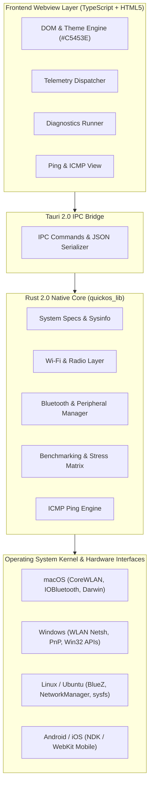

# quickOS Architecture Specification

**Product:** quickOS — Universal Diagnostics & Hardware Suite  
**Organization:** UCDREAMS TECHNOLOGIES LLP (<https://ucdreams.com>)  
**Lead Developer:** Uchit Chakma (<https://uchitchakma.com>)

---

## 1. High-Level Architecture Overview

quickOS is designed around a lightweight, multi-layered architecture separating high-performance native OS interrogation (Rust) from zero-bloat user interface rendering (Native OS WebViews).

---

## 2. Platform Interrogation Strategies

| Component | macOS (Darwin) | Linux (Ubuntu/Debian) | Windows (10/11) |
| :--- | :--- | :--- | :--- |
| **System Info & CPU** | `sysinfo` + `sysctl` | `sysinfo` + `/proc/cpuinfo` | `sysinfo` + WMI |
| **Memory & Disks** | `sysinfo` + APFS mounts | `sysinfo` + `statvfs` | `sysinfo` + NTFS/FAT |
| **Wi-Fi Scanner** | `networksetup` + `wdutil` | `nmcli` + `iwconfig` | `netsh wlan` |
| **Bluetooth Scanner** | `system_profiler SPBluetooth` | `bluetoothctl` + `BlueZ` | `PowerShell Get-PnpDevice` |
| **Battery Power** | `pmset -g batt` | `/sys/class/power_supply` | `Win32_Battery` |
| **Network Latency** | POSIX `ping -c 2` | POSIX `ping -c 2` | Win32 `ping -n 2` |

---

## 3. Brand Identity & Theme Tokens

- **Primary Brand Color:** `#C5453E`
- **Hover / Accent:** `#D8564F`
- **Background Base:** `#0B0D11`
- **Cards Base:** `#151922`
- **Corporate Entity:** UCDREAMS TECHNOLOGIES LLP
- **Lead Developer:** Uchit Chakma
