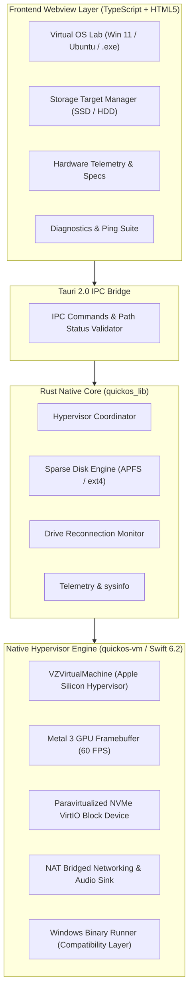

# quickOS Architecture Specification

**Product:** quickOS — Universal Local OS Virtualization, Hypervisor & Cross-Platform App Runner  
**Organization:** UCDREAMS TECHNOLOGIES LLP (<https://ucdreams.com>)  
**Lead Developer:** Uchit Chakma (<https://uchitchakma.com>)

---

## 1. High-Level Architecture Overview

quickOS is engineered with a high-performance multi-tier architecture separating the **Native Apple Hypervisor Engine** (Swift + `Virtualization.framework`), the **Hardware Interrogation & IPC Core** (Rust + Tauri 2.0), and the **Zero-Bloat UI** (TypeScript + HTML5).

---

## 2. Operating System Virtualization Pipeline

| Target OS / Mode | Engine Core | Acceleration & Hardware Drivers | Storage Strategy |
| :--- | :--- | :--- | :--- |
| **Windows 11 ARM64** | `VZVirtualMachine` | Metal 3 GPU + NVMe VirtIO + USB HID + Audio Sink | APFS Sparse Disk (`.img` / `.raw`) on SSD/HDD |
| **Ubuntu Linux 24.04** | Direct Linux Kernel VM | VirtIO GPU + VirtIO Console + NAT Bridge | APFS Sparse Disk (`.img`) on SSD/HDD |
| **Windows .exe Launcher** | Native Binary Translator | Win32 / POSIX API Layer | Direct execution from Host or External SSD |

---

## 3. Brand Identity & Design Tokens

- **Primary Brand Color:** `#C5453E`
- **Hover / Accent:** `#D8564F`
- **Background Base:** `#0B0D11`
- **Cards Base:** `#151922`
- **Corporate Entity:** UCDREAMS TECHNOLOGIES LLP
- **Lead Developer:** Uchit Chakma
