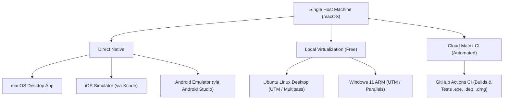

# Cross-Platform Testing Guide (Zero Additional Hardware)

**Product:** quickOS  
**Published by:** UCDREAMS TECHNOLOGIES LLP (<https://ucdreams.com>)  
**Lead Developer:** Uchit Chakma (<https://uchitchakma.com>)

---

## 🎯 Goal: Test macOS, Windows, Ubuntu/Linux, Android, and iOS from a Single Host

You do **NOT** need to purchase 5 different laptops to test your applications. Since your primary workstation is a **Mac**, you have the universal development host.



---

## 1. Testing macOS & iOS
* **macOS:** Run directly via `npm run tauri dev` or `cargo run`.
* **iOS:**
  1. Open Xcode -> Settings -> Components -> Install iOS Simulator (e.g. iPhone 16 Pro).
  2. Run `pnpm tauri ios dev`.
  3. The app will launch directly on the iOS Simulator on your Mac screen.

---

## 2. Testing Android
1. Download **Android Studio** (Free).
2. Open **Virtual Device Manager (AVD)** and create a virtual device (e.g. Pixel 8 with Android 15/16).
3. Run `pnpm tauri android dev`.
4. Your native Android APK will compile and run live inside the emulator.

---

## 3. Testing Ubuntu / Linux Desktop
Choose either method:
* **Option A (Instant Headless / CLI):**
  ```bash
  # Install lightweight Ubuntu instances in seconds
  brew install multipass
  multipass launch --name quickos-ubuntu
  multipass shell quickos-ubuntu
  ```
* **Option B (Full GUI Desktop via UTM - 100% Free):**
  1. Install [UTM for Mac](https://mac.getutm.app/).
  2. Download Ubuntu 24.04 ARM64 desktop ISO.
  3. Launch Ubuntu in a native window with full GUI and Wi-Fi emulation.

---

## 4. Testing Windows 11
* **Option A (UTM / VMware Fusion Free / Parallels):**
  1. Download Windows 11 ARM Insider / ISO from Microsoft.
  2. Run Windows 11 inside UTM directly on macOS. Windows 11 ARM has built-in x64 emulation to test both 32-bit and 64-bit binaries.
* **Option B (GitHub Actions Cloud Builds):**
  Every time you push code to `github.com/uchitchakma/quickOS`, GitHub spins up a Windows runner, compiles your `.exe` installer, runs tests, and publishes artifacts to download!

---

## 5. Summary Matrix

| Target OS | Testing Method on Single Mac | Cost | Hardware Needed |
| :--- | :--- | :--- | :--- |
| **macOS** | Native Execution | $0 | None (Already Host) |
| **iOS** | Xcode iOS Simulator | $0 | None |
| **Android** | Android Studio Emulator | $0 | None |
| **Ubuntu Linux** | UTM VM or Multipass | $0 | None |
| **Windows 11** | UTM VM or GitHub Actions | $0 | None |
